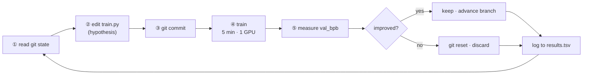
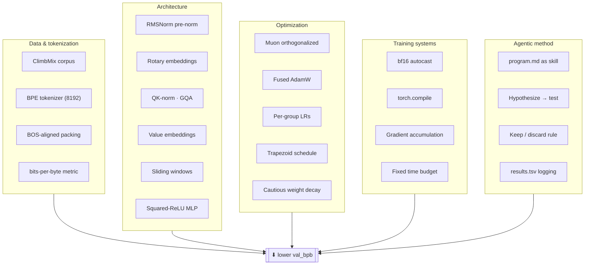
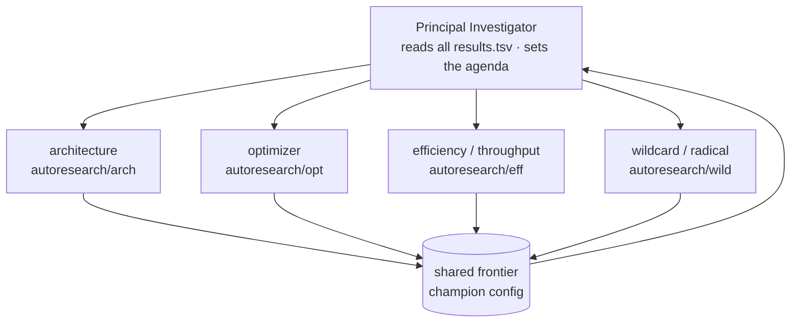
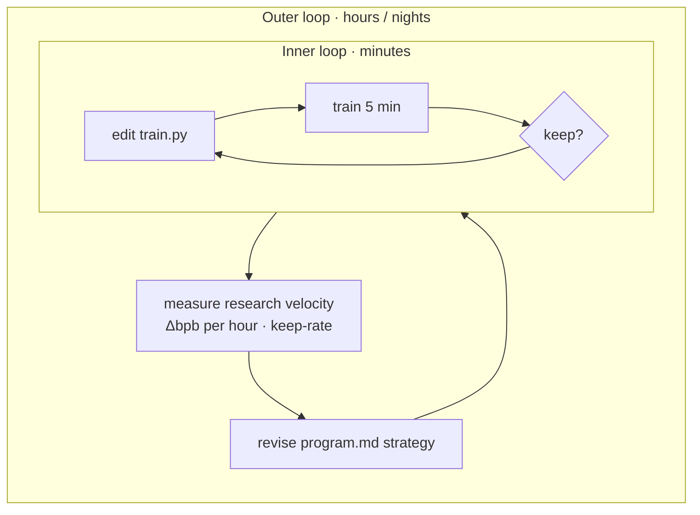

# autoresearch


> *One day, frontier AI research used to be done by meat computers in between eating, sleeping, having other fun, and synchronizing once in a while using sound wave interconnect in the ritual of "group meeting". That era is long gone. Research is now entirely the domain of autonomous swarms of AI agents running across compute cluster megastructures in the skies. The agents claim that we are now in the 10,205th generation of the code base, in any case no one could tell if that's right or wrong as the "code" is now a self-modifying binary that has grown beyond human comprehension. This repo is the story of how it all began.* — [@karpathy](https://x.com/karpathy/status/2029701092347630069), March 2026

**autoresearch is a sandbox for autonomous AI research.** You give an AI agent a small but real LLM training setup and let it experiment on its own: it modifies the code, trains for five minutes, checks whether the result improved, keeps or discards, and repeats. You go to sleep and wake up to a log of experiments and — hopefully — a better model.

The twist is *what you program*. You don't touch the Python files the way a researcher normally would. Instead you write `program.md`, the Markdown file that instructs the agent and sets up your autonomous research org. The default `program.md` is a deliberately bare-bones baseline, but it's obvious how you'd iterate on it over time — refining the strategy, adding more agents to the mix — to find the "research org code" that makes the fastest progress.

The training code is a simplified single-GPU implementation of [nanochat](https://github.com/karpathy/nanochat). More context is in [this tweet](https://x.com/karpathy/status/2029701092347630069) and [this one](https://x.com/karpathy/status/2031135152349524125). New to neural networks? This ["Dummy's Guide"](https://x.com/hooeem/status/2030720614752039185) is a good primer.

|  | |
|---|---|
| **What it is** | A harness for agent-driven ML research, a clean modern-GPT reference implementation, and a fair, reproducible benchmark. |
| **What it is not** | A chatbot, an inference server, or an application framework. It only *pretrains* small models to minimize one number — there's no serving, fine-tuning, or product layer. |

---

This README is both the project overview and a **study guide**. If you just want to run it, jump to [Quick start](#quick-start). If you want to *learn* from it, start with [What you'll learn](#what-youll-learn) and pick a [learning path](#learning-paths).

**Contents**

- [How it works](#how-it-works)
- [Quick start](#quick-start)
- [Running the agent](#running-the-agent)
- [What you'll learn](#what-youll-learn)
- [Concept map](#concept-map)
- [Learning paths](#learning-paths)
- [The files in detail](#the-files-in-detail)
- [Hands-on exercises](#hands-on-exercises)
- [Glossary](#glossary)
- [Self-check](#self-check)
- [Scaling up: a continuous research org](#scaling-up-a-continuous-research-org)
- [Design choices](#design-choices)
- [Platform support](#platform-support)
- [Notable forks](#notable-forks)
- [Further reading](#further-reading)
- [License](#license)

## How it works

The repo is deliberately tiny. Four files matter, and they split cleanly by *who* is allowed to touch them:

- **`prepare.py`** — *frozen.* Fixed constants, one-time data prep (downloads training data, trains a BPE tokenizer), and runtime utilities (dataloader, evaluation). Never modified — that's what keeps every experiment comparable.
- **`train.py`** — *the agent edits this.* The full GPT model, optimizer (Muon + AdamW), and training loop. Everything is fair game: architecture, hyperparameters, optimizer, batch size, model size.
- **`program.md`** — *the human edits this.* Baseline instructions for the agent. Point your agent here and let it go. This is your "skill" — the research strategy.
- **`analysis.ipynb`** — *yours to run.* Loads `results.tsv` and charts the run: keep-rate, the descending frontier of best `val_bpb` over time, and cumulative effort per improvement.

Training runs for a **fixed 5-minute time budget** (wall clock, excluding startup/compilation), regardless of your compute. The metric is **`val_bpb`** (validation bits per byte) — lower is better, and vocab-size-independent so architectural changes are fairly compared.

The heartbeat of the project is the experiment loop — the scientific method compiled into git:



The agent hypothesizes (edit), snapshots (commit), tests (train), measures (`val_bpb`), and keeps-or-reverts — then does it again. It runs the loop until a human interrupts it.

## Quick start

**Requirements:** A single NVIDIA GPU (tested on H100), Python 3.10+, [uv](https://docs.astral.sh/uv/).

```bash
# 1. Install uv project manager (if you don't already have it)
curl -LsSf https://astral.sh/uv/install.sh | sh

# 2. Install dependencies
uv sync

# 3. Download data and train tokenizer (one-time, ~2 min)
uv run prepare.py

# 4. Manually run a single training experiment (~5 min)
uv run train.py
```

If those commands all work, your setup is good and you can go into autonomous research mode.

## Running the agent

Spin up your Claude / Codex / whatever in this repo (and disable all permissions), then prompt something like:

```
Hi have a look at program.md and let's kick off a new experiment! let's do the setup first.
```

The `program.md` file is essentially a super lightweight "skill" that turns a coding agent into a researcher.

## What you'll learn

This repo is unusually dense for its size — a live tour of the modern state of the art. Study it and you come away fluent in four distinct areas:

- **🧠 Modern LLM architecture** — rotary embeddings, QK-norm, grouped-query attention, value embeddings, sliding-window attention, squared-ReLU MLPs. The toolkit that replaced GPT-2's design, all in one readable file.
- **⚙️ Optimization & training craft** — the Muon optimizer, learning-rate schedules, gradient accumulation, bf16 + `torch.compile`, MFU, and the fixed-budget discipline that makes runs comparable.
- **🤖 Autonomous agents** — how a plain Markdown file becomes a reliable "skill": how to specify a loop, guardrails, logging, and a stop condition so an agent works unattended without going off the rails.
- **🔬 The scientific method** — baseline first, one change at a time, measure honestly, keep or revert, and analyze the record afterward. Good experimental hygiene, made concrete in code and a results log.

## Concept map

Every idea in the repo feeds one objective: **a lower `val_bpb` in five minutes**. Here's the landscape, grouped by domain. The [glossary](#glossary) defines the essential terms.



The design's real elegance is its **separation of concerns**: the frozen `prepare.py` (data + metric) guarantees fairness, `train.py` holds every tunable idea, and `program.md` holds the *research strategy*. You can study any one column without the others.

## Learning paths

Three routes through the same material, depending on where you're starting. Each ends with you running or reading real code.

<details>
<summary><b>Track A — New to neural networks</b></summary>

> Goal: understand what's being trained and why the loop works, without drowning in optimizer math.

1. Read this README top to bottom, plus the linked "Dummy's Guide."
2. Run the setup end-to-end (`uv sync` → `uv run prepare.py` → `uv run train.py`) and watch the live loss tick down.
3. Learn to read the [output summary](#output-format) — the [glossary](#glossary) defines each line.
4. Do exercises 1 & 2: run the baseline, change one learning rate, log the result. You've now done the loop by hand.
5. Skim `train.py` for the big picture — don't sweat the details yet.

</details>

<details>
<summary><b>Track B — ML practitioner / researcher</b></summary>

> Goal: master the modern architecture + optimizer and the fixed-budget benchmarking discipline.

1. Read `train.py` top to bottom.
2. Study the **Muon optimizer** block (the `muon_step_fused` function): momentum → orthogonalization → NorMuon → cautious decay. Compare it to the AdamW path.
3. Read `prepare.py`'s **bits-per-byte** eval (`evaluate_bpb`) and the BOS-packed dataloader — understand why the metric is vocab-independent.
4. Run exercises 4–7: ablate value embeddings, swap the activation, change the window pattern, scale `DEPTH`. Measure each.
5. Use `analysis.ipynb` to plot your frontier and keep-rate. Reason about compute-vs-quality on *your* GPU.

</details>

<details>
<summary><b>Track C — Agents & systems</b></summary>

> Goal: learn how to specify a reliable autonomous agent and reason about research-org design.

1. Read `program.md` as a case study in **agent instruction design**: setup, guardrails, output format, logging, and the "NEVER STOP" clause.
2. Map its rules to the loop diagram above. Note how each guardrail (timeout, crash handling, keep/discard) removes a failure mode.
3. Run an agent against it and watch `results.tsv` grow. Observe how it recovers from crashes.
4. Do exercise 9: edit `program.md` (e.g., "when stuck, combine two prior near-misses") and compare research trajectories.
5. Design a multi-agent variant — parallel branches per GPU — and reason about how you'd merge their findings.

</details>

## The files in detail

| File | Role | Who edits it | What it teaches |
|------|------|--------------|-----------------|
| `prepare.py` | data · tokenizer · metric | 🔒 frozen | Tokenization, data pipelines, and why a fixed vocab-independent metric matters. |
| `train.py` | model · optimizer · loop | ✏️ the agent | Modern transformer architecture and training-loop engineering. |
| `program.md` | agent instructions | 👤 the human | How to specify reliable, unattended agent behavior with guardrails and a stop condition. |
| `analysis.ipynb` | results analysis | 📊 you | How to read an experiment record and quantify research progress. |

### The model at a glance

`train.py` implements a modern GPT — not the GPT-2 design, but the current speedrun-era stack. The forward pass mirrors the code exactly: the token embedding is normalized once and stashed as `x₀`, then re-injected (with a learned weight) before every block, so each layer keeps direct access to the raw input.


Every labeled trick — RoPE, QK-norm, GQA, value embeddings, sliding windows, squared-ReLU — is defined in the [glossary](#glossary). Model width is derived from a single knob: `model_dim = DEPTH × 64` (rounded to the head dimension), so heads and learning-rate scaling all follow from `DEPTH`.

### Output format

Once a run finishes it prints a summary like this:

```
---
val_bpb:          0.997900
training_seconds: 300.1
total_seconds:    325.9
peak_vram_mb:     45060.2
mfu_percent:      39.80
total_tokens_M:   499.6
num_steps:        953
num_params_M:     50.3
depth:            8
```

The numbers vary by platform since the script always stops after 5 minutes. Extract the key metric with `grep "^val_bpb:" run.log`.

### Logging results

When an experiment is done, log it to `results.tsv` (tab-separated — commas break in descriptions). Five columns:

```
commit	val_bpb	memory_gb	status	description
a1b2c3d	0.997900	44.0	keep	baseline
b2c3d4e	0.993200	44.2	keep	increase LR to 0.04
c3d4e5f	1.005000	44.0	discard	switch to GeLU activation
d4e5f6g	0.000000	0.0	crash	double model width (OOM)
```

`status` is `keep`, `discard`, or `crash`; use `0.000000` / `0.0` for crashes. Leave `results.tsv` untracked by git. Once you have a handful of rows, `analysis.ipynb` will chart the frontier — most experiments get discarded, and the running minimum tells the story of progress.

## Hands-on exercises

Learning sticks when you move a knob and watch the number change. Each of these is a real edit to `train.py` (the config block lives near the bottom). Log every result to `results.tsv`. Difficulty: 🟢 starter · 🟡 intermediate · 🔴 advanced.

1. **🟢 Establish the baseline.** Run `uv run train.py > run.log 2>&1`, then `grep "^val_bpb:" run.log`. Make sure you can explain every line of the summary.
2. **🟢 Move one learning rate.** Bump `MATRIX_LR` (Muon) or `EMBEDDING_LR` up ~25%, re-run, record keep/discard. This is the full research loop, by hand. Did aggression help in 5 minutes, or destabilize training?
3. **🟡 Reshape the LR schedule.** Try a short warmup (`WARMUP_RATIO = 0.05`) or a non-zero `FINAL_LR_FRAC`. Compare against baseline.
4. **🟡 Swap the activation.** Replace the squared-ReLU in the MLP (`F.relu(x).square()`) with GeLU. Measure the `val_bpb` cost. Cheap activations are often surprisingly competitive per unit of compute.
5. **🟡 Ablate value embeddings.** Force `has_ve()` to return `False` and re-run. How much do the gated value embeddings actually buy? Ablation is how you learn what earns its keep.
6. **🟡 Trade attention range for throughput.** Change `WINDOW_PATTERN` from `"SSSL"` to `"L"` (all full-context) and to `"SSSSSSSL"`. Watch tokens/sec and steps rise or fall against `val_bpb`.
7. **🔴 Scale with a single knob.** Set `DEPTH` to 6, then 10. Width, heads, and LR scaling follow automatically. Find the depth that best fits your GPU's 5-minute budget.
8. **🔴 Analyze the record.** After a dozen experiments, open `analysis.ipynb`. Read your keep-rate and frontier. Which single change bought the most? How many tries did each improvement cost?
9. **🔴 Program the researcher.** Edit `program.md` — add a strategy rule — then run an agent overnight and compare its trajectory to the baseline instructions. You're now optimizing the *research org*, not the model.

## Glossary

The vocabulary you need to read the code and the output.

| Term | Meaning |
|------|---------|
| **val_bpb** | *Validation bits per byte* — the one metric. Per-token loss normalized by target byte length, so it's independent of vocab size. Lower is better. |
| **BPE tokenizer** | Byte-pair encoding that merges frequent character pairs into an 8,192-token vocabulary. Trained once in `prepare.py`. |
| **RMSNorm** | Normalization by root-mean-square only (no mean-centering). Parameter-free here, applied pre-block and even on Q/K. |
| **Rotary embeddings (RoPE)** | Positions encoded by rotating Q/K vectors — captures *relative* position and extrapolates past the trained length. |
| **QK-norm** | Normalizing queries and keys before attention. Bounds logits and prevents blow-ups — key to stable high-LR training. |
| **GQA** | *Grouped-query attention* — fewer key/value heads than query heads, shrinking the KV cache. |
| **Value embeddings** | A "ResFormer" trick: a gated per-token value signal injected into attention on alternating layers, giving direct access to token content. |
| **Sliding-window attention** | Limiting each layer's attention span (S = half, L = full context) to save compute. The `SSSL` pattern mixes local and global layers. |
| **Muon** | The optimizer for 2-D weight matrices. It *orthogonalizes* the momentum update so all directions get comparable step sizes. |
| **AdamW** | Adaptive optimizer used here for embeddings, the head, and scalars — each with its own tuned learning rate. Fused & compiled. |
| **Gradient accumulation** | Summing gradients over several micro-batches to reach a large effective batch (~524K tokens) without the memory of one giant batch. |
| **MFU** | *Model FLOPs utilization* — fraction of the GPU's peak compute actually used; a throughput efficiency score. |
| **bf16 autocast** | Running math in 16-bit brain-float for speed and memory, with automatic precision management. |
| **Warmdown schedule** | The LR holds flat, then decays linearly to zero over the final half of the run — no warmup, a trapezoid. |

## Self-check

Try to answer each before expanding it. If you can answer all eight, you understand the repo's core ideas.

<details><summary><b>Why measure bits-per-byte instead of loss or perplexity?</b></summary><br>Because it normalizes by target byte length, making the score independent of vocabulary size — so two architectures with different tokenizers or vocabs are still directly comparable.</details>

<details><summary><b>Why does training count wall-clock time but skip the first 10 steps?</b></summary><br>To exclude one-time <code>torch.compile</code> / warmup cost, so the 5-minute budget measures steady-state training only — and stays fair across different GPUs.</details>

<details><summary><b>What makes Muon different from Adam?</b></summary><br>Muon orthogonalizes the momentum update (via a Newton–Schulz-style "Polar Express" iteration) before applying it, so every direction of a weight matrix's update gets a comparable step size. It's used only for 2-D matrices.</details>

<details><summary><b>What problem does QK-norm solve?</b></summary><br>It bounds the size of attention logits, preventing the entropy collapse / numerical blow-ups that otherwise appear under aggressive learning rates.</details>

<details><summary><b>Why re-inject the input embedding x₀ into every layer?</b></summary><br>Deep stacks dilute the original signal. Feeding the normalized input back in (with a learned per-layer weight) gives every block cheap, direct access to token identity.</details>

<details><summary><b>What is the keep-or-discard rule?</b></summary><br>If the new val_bpb is lower than the best so far, keep the commit and advance the branch. Otherwise <code>git reset</code> back to where you started. Log both to results.tsv.</details>

<details><summary><b>What does the "S" vs "L" in SSSL mean?</b></summary><br>S = a short sliding window (half the 2048 context); L = full context. Most layers are S for speed; the pattern repeats and the final layer is always forced to L.</details>

<details><summary><b>Why is program.md the file the human edits, not train.py?</b></summary><br>Because you're not tuning the model — you're programming the <em>agent that tunes it</em>. program.md is the research strategy ("skill"); improving it improves the whole autonomous research org.</details>

## Scaling up: a continuous research org

The default `program.md` is the simplest possible research org: one agent, one hill-climb, one metric. But the repo's whole conceit — the "10,205th generation, self-modifying" flavor text — is an invitation to build *better* orgs. The training code (`train.py`, `prepare.py`) stays exactly as-is; everything below is built by editing `program.md` and adding thin orchestration around it (git branches, a couple of Markdown files, a scheduler).

Here are blueprints, from a single sharper agent to a self-improving swarm. Mix and match. Several ship as runnable starter files in [`examples/`](examples/) — look for the **📎 starter** pointers below.

### 1. Comprehensive goal setting (a research charter)

The single instruction "get the lowest `val_bpb`" is a weak goal — it says nothing about constraints, priorities, or what to do when stuck. Replace it with a **charter** the agent reads at the top of every cycle. This is the highest-leverage change you can make.

```markdown
## Research charter

**North star:** minimize val_bpb on the fixed 5-minute budget.

**Hard constraints (never violate):**
- peak_vram_mb must stay under 60000 — treat OOM as a discard, not a bug to chase
- prepare.py is read-only; evaluate_bpb is ground truth

**Milestones (advance in order, record when each is hit):**
1. M1 — reproduce and record the baseline
2. M2 — beat baseline by >= 1% val_bpb
3. M3 — hold M2's val_bpb while cutting peak_vram_mb by 10%
4. M4 — beat M2 by another 1%, any means

**Idea-selection priorities (when choosing the next experiment):**
1. Prefer changes with a clear mechanistic hypothesis over blind sweeps
2. Prefer simplifications that hold the metric (delete-and-win)
3. Revisit the two best DISCARDED ideas and try combining them
4. Change only one substantive thing per experiment

**Pivot / stop:**
- If 15 experiments pass with no improvement, switch category:
  architecture -> optimizer -> schedule -> data packing
- Never stop on your own; run until interrupted
```

Comprehensive goals turn a random walk into a directed search: the agent knows what "good" means, what it may not touch, and how to get unstuck.

> 📎 **starter:** [`examples/program.charter.md`](examples/program.charter.md) — a complete drop-in `program.md` with this charter built in.

### 2. A lab notebook that persists across nights

`results.tsv` records *what* happened; it doesn't record *why*, or the lessons. Add a `LESSONS.md` the agent **reads before every experiment and appends after** — the difference between an agent that rediscovers the same dead ends nightly and one whose knowledge compounds.

```markdown
# Lessons (read before every experiment; append after)

## Dead ends — do not retry
- GeLU activation: consistently +0.004 bpb vs ReLU^2 (exp #12, #29)
- matrix_lr > 0.06: diverges within ~200 steps (exp #7)

## Live leads — promising, revisit
- value-embedding gate channels 32 -> 64: -0.001 but noisy; retry with more steps
- shorter windows freed throughput but hurt long-range; try SSSL -> SSSSL

## Confirmed wins — currently in champion
- matrix_lr 0.04 -> 0.045 (-0.002)
```

This is what makes research *continuous* rather than episodic: memory that survives a restarted container.

> 📎 **starter:** [`examples/LESSONS.md`](examples/LESSONS.md) — the lab-notebook template.

### 3. A specialist swarm

One GPU, one agent is a bottleneck. Run several agents in parallel, each on its own branch with a **focused mandate**, plus a "principal investigator" that periodically reads every branch's `results.tsv`, crowns the current champion, merges wins into a shared baseline, and reassigns focus.



Because `val_bpb` is a single comparable number and each agent works on its own branch, merging is trivial: the champion is just whichever branch holds the lowest number.

> 📎 **starter:** [`examples/program.swarm.md`](examples/program.swarm.md) — roles + a principal-investigator protocol.

### 4. Evolutionary search

The built-in keep/discard loop is hill-climbing. Generalize it to a **population**: treat each branch's config as an individual, `val_bpb` as fitness, and add genetic operators —

| Operator | Implementation |
|----------|----------------|
| **Selection** | Rank branches by `val_bpb`; cull the worst |
| **Mutation** | Fork a top branch, perturb one knob (LR, depth, window) |
| **Crossover** | Create a branch combining the winning changes from two near-misses |
| **Elitism** | Never overwrite the current champion |

This escapes the local minima a single greedy climber gets stuck in.

### 5. A research curriculum

Instead of one static goal, give the org a **ladder** that unlocks as each rung is met — reproduce baseline → beat it by 1% → beat it under a VRAM cap → simplify at equal metric → beat it again. The agent advances its own difficulty, so the frontier keeps moving even after easy wins are exhausted. (This pairs naturally with the milestones in the charter above.)

### 6. The meta-loop: optimize the researcher, not the model

The most ambitious version. Treat `program.md` *itself* as the thing under optimization. An outer loop measures **research velocity** — improvement in `val_bpb` per hour, keep-rate, time-to-first-improvement — and A/B tests different strategies (charter wording, idea-selection heuristics, pivot rules). This is the self-modifying "generation N+1" the README jokes about, made literal.



### 7. Always-on operations

To make it truly continuous rather than something you babysit:

- **Schedule it** — kick off a fresh run on a nightly cron so the lab never idles.
- **Dashboard it** — a live view of the frontier, keep-rate, and champion over time.
- **Report it** — auto-generate a "morning report" summarizing the night's frontier moves and the current champion.
- **Alert it** — ping yourself only when a new record is set, so you can stay hands-off otherwise.

> 📎 **starter:** [`examples/dashboard.py`](examples/dashboard.py) — `uv run examples/dashboard.py` prints the dashboard and can emit a Markdown report or a PNG frontier plot.

---

**Composing these** — a charter (#1) for direction, a lab notebook (#2) for memory, a swarm (#3) for parallelism, evolution (#4) to avoid local minima, a curriculum (#5) for endless goals, and a meta-loop (#6) that improves the whole apparatus — is how you turn a five-minute training script into a research org that runs itself.

> **A note on scope.** This repo gives you the *substrate* for continuous research: a fair metric, a fast loop, and git-based keep/discard. It's still small-model pretraining on one GPU — you won't discover a new architecture overnight. What genuinely transfers is the **methodology**: goal setting, memory, parallel search, and self-improvement are the same patterns you'd use to point agents at far bigger problems. This is a place to practice building the org, cheaply.

## Design choices

- **Single file to modify.** The agent only touches `train.py`. This keeps the scope manageable and diffs reviewable.
- **Fixed time budget.** Training always runs for exactly 5 minutes, regardless of platform. This means ~12 experiments/hour and ~100 while you sleep. Two upsides: experiments are directly comparable regardless of what the agent changes (model size, batch size, architecture), and autoresearch finds the most optimal model *for your platform* in that budget. The downside is that your results aren't comparable to people running on other compute.
- **Self-contained.** No external dependencies beyond PyTorch and a few small packages. No distributed training, no complex configs. One GPU, one file, one metric.

## Platform support

This code currently requires a single NVIDIA GPU. Supporting CPU, MPS, and other platforms is quite possible in principle but would bloat the code. People can reference (or have their agents reference) the full/parent [nanochat](https://github.com/karpathy/nanochat) repo, which has wider platform support and shows the various solutions (a Flash Attention 3 kernels fallback, generic device support, autodetection, etc.). Forks for other platforms are welcome — see below.

If you're running autoresearch on much smaller compute (Macbooks etc.), consider one of the [forks](#notable-forks), and tune the defaults for smaller models:

1. Use a lower-entropy dataset, e.g. this [TinyStories dataset](https://huggingface.co/datasets/karpathy/tinystories-gpt4-clean) (GPT-4 generated short stories). Narrower data gives reasonable results with much smaller models.
2. Decrease `vocab_size`, e.g. from 8192 down to 4096, 2048, 1024, or even a byte-level tokenizer (256 possible bytes after UTF-8 encoding).
3. In `prepare.py`, lower `MAX_SEQ_LEN` a lot — even to 256. As you lower it, consider increasing `DEVICE_BATCH_SIZE` in `train.py` to compensate. Tokens per fwd/bwd pass is the product of the two.
4. Also in `prepare.py`, decrease `EVAL_TOKENS` so validation is evaluated on less data.
5. In `train.py`, the primary knob for model complexity is `DEPTH` (default 8). Many variables are functions of it, so lower it to e.g. 4.
6. Use a `WINDOW_PATTERN` of just `"L"` — `"SSSL"` uses an alternating banded attention pattern that may be inefficient for you. (Try it.)
7. Lower `TOTAL_BATCH_SIZE` a lot, but keep it a power of 2, e.g. down to `2**14` (~16K).

Ask your favorite coding agent for help and paste it this guide plus the full source code.

## Notable forks

- [miolini/autoresearch-macos](https://github.com/miolini/autoresearch-macos) (MacOS)
- [trevin-creator/autoresearch-mlx](https://github.com/trevin-creator/autoresearch-mlx) (MacOS)
- [jsegov/autoresearch-win-rtx](https://github.com/jsegov/autoresearch-win-rtx) (Windows)
- [andyluo7/autoresearch](https://github.com/andyluo7/autoresearch) (AMD)

## Further reading

- **[nanochat](https://github.com/karpathy/nanochat)** — the fuller parent project this training code is cherry-picked from, with wider platform support.
- **modded-nanogpt** — the training-speedrun lineage where Muon, value embeddings, and these tricks were battle-tested.
- **The Muon writeup** — how orthogonalized momentum works and why it helps matrix parameters.
- **RoFormer (RoPE)** and **ResFormer** (value residuals) — primary sources for two of the architecture's key ideas.
- **[@karpathy's launch tweets](https://x.com/karpathy/status/2029701092347630069)** and the ["Dummy's Guide"](https://x.com/hooeem/status/2030720614752039185) for gentler background.

## License

MIT
