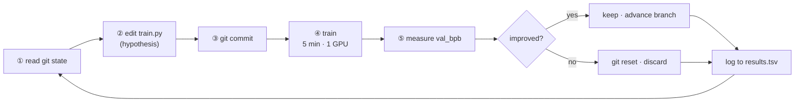
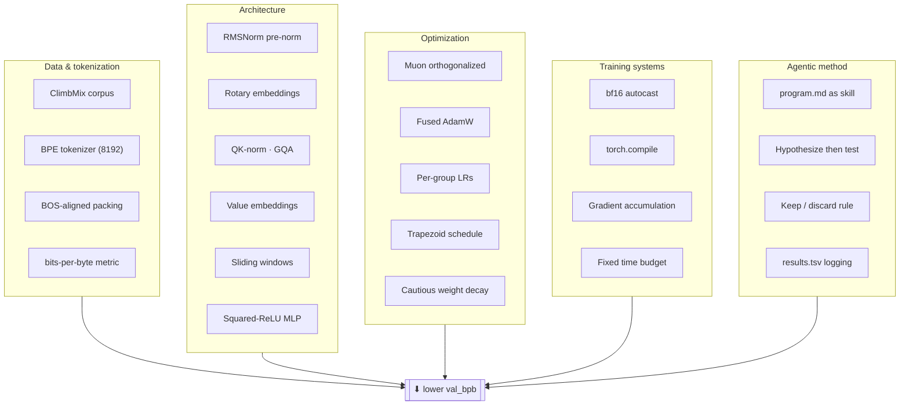
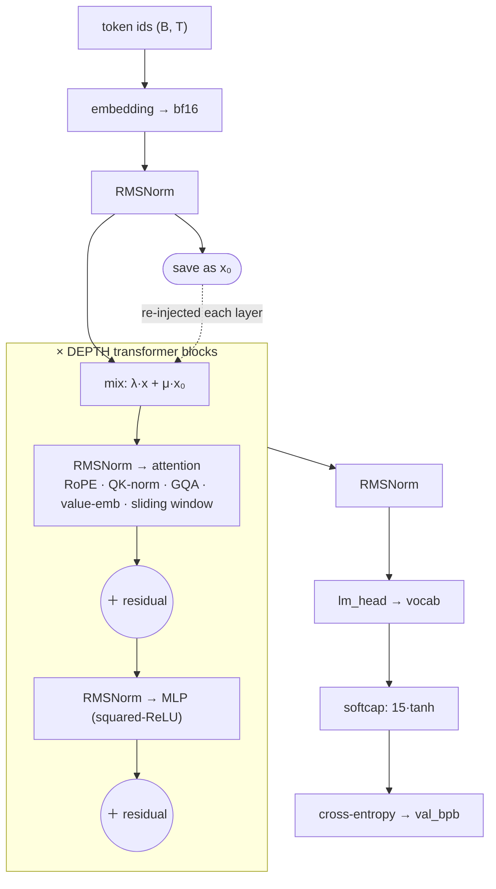
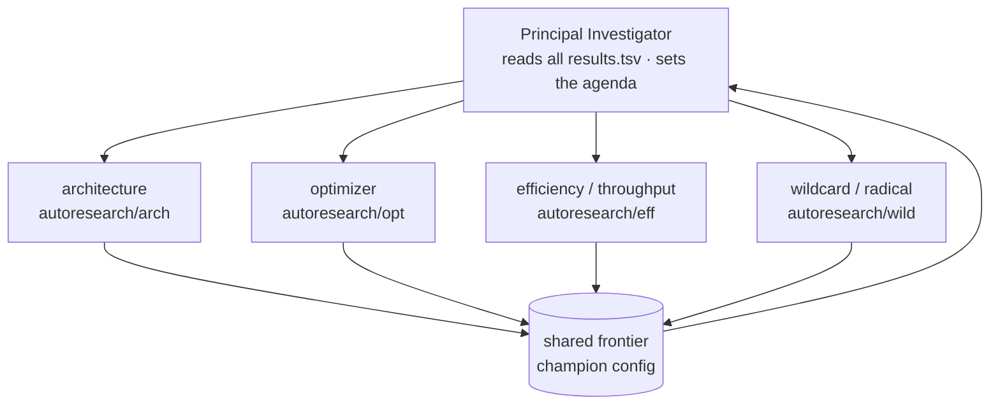
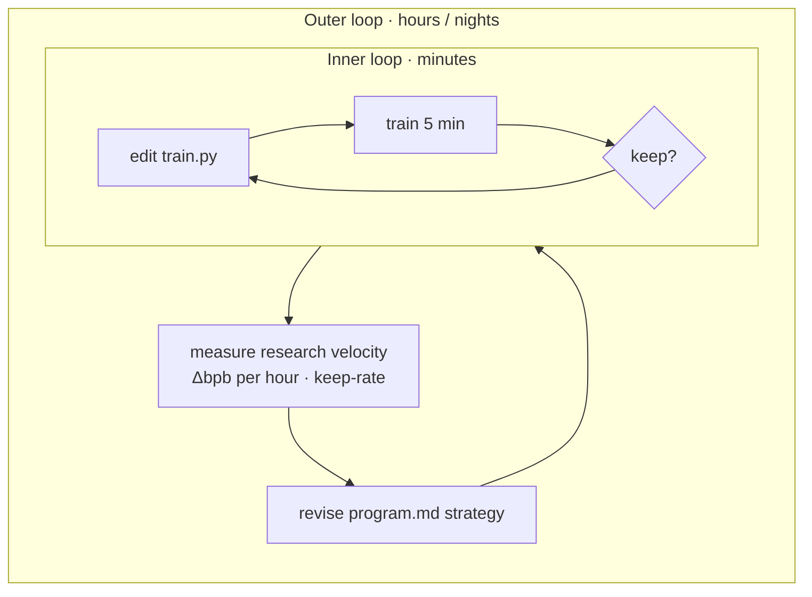

# autoresearch


> *One day, frontier AI research used to be done by meat computers in between eating, sleeping, having other fun, and synchronizing once in a while using sound wave interconnect in the ritual of "group meeting". That era is long gone. Research is now entirely the domain of autonomous swarms of AI agents running across compute cluster megastructures in the skies. The agents claim that we are now in the 10,205th generation of the code base, in any case no one could tell if that's right or wrong as the "code" is now a self-modifying binary that has grown beyond human comprehension. This repo is the story of how it all began.*
>
> [@karpathy](https://x.com/karpathy/status/2029701092347630069), March 2026

**autoresearch is a sandbox for autonomous AI research.** You hand an AI agent a small but real language-model training setup and let it experiment on its own. It edits the code, trains for five minutes, checks whether the result improved, keeps the change or throws it away, and repeats. You go to sleep and wake up to a log of experiments and, hopefully, a better model.

Here is the twist: you don't tune the model yourself. You write `program.md`, the plain Markdown file that tells the agent how to do research. You are programming the researcher, not the model. The default `program.md` is a deliberately bare-bones starting point, and the whole game is improving it over time (sharpening the strategy, adding more agents) until you have a research org that makes progress as fast as possible.

The training code is a simplified single-GPU version of [nanochat](https://github.com/karpathy/nanochat). For more background, see [this tweet](https://x.com/karpathy/status/2029701092347630069) and [this one](https://x.com/karpathy/status/2031135152349524125). New to neural networks? The ["Dummy's Guide"](https://x.com/hooeem/status/2030720614752039185) is a friendly primer.

|  | |
|---|---|
| **What it is** | A harness for agent-driven ML research, a clean reference implementation of a modern GPT, and a fair, reproducible benchmark. |
| **What it is not** | A chatbot, an inference server, or an app framework. It only *pretrains* small models to minimize one number. There is no serving, fine-tuning, or product layer. |

---

This README is both the project overview and a **study guide**. If you just want to run it, jump to [Quick start](#quick-start). If you want to *learn* from it, follow [Your first hour](#your-first-hour), then pick a [learning path](#learning-paths).

**Contents**

- [How it works](#how-it-works)
- [Quick start](#quick-start)
  - [Renting a GPU on vast.ai](#renting-a-gpu-on-vastai)
- [Running the agent](#running-the-agent)
- [Your first hour](#your-first-hour)
- [What you'll learn](#what-youll-learn)
- [Concept map](#concept-map)
- [Learning paths](#learning-paths)
- [The files in detail](#the-files-in-detail)
- [Hands-on exercises](#hands-on-exercises)
- [Glossary](#glossary)
- [Self-check](#self-check)
- [Scaling up: a continuous research org](#scaling-up-a-continuous-research-org)
- [Design choices](#design-choices)
- [Platform support](#platform-support)
- [Notable forks](#notable-forks)
- [Further reading](#further-reading)
- [License](#license)

## How it works

The repo is deliberately tiny. Four files matter, and they split cleanly by *who* is allowed to touch them:

- **`prepare.py`** (frozen). Fixed constants, one-time data prep (it downloads the training data and trains a BPE tokenizer), and runtime helpers (the dataloader and the evaluation). You never modify it, and that is exactly what keeps every experiment comparable.
- **`train.py`** (the agent edits this). The full GPT model, the optimizer (Muon plus AdamW), and the training loop. Everything is fair game: architecture, hyperparameters, optimizer, batch size, model size.
- **`program.md`** (you edit this). The agent's instructions. Point your agent at it and let it go. This is your "skill", the research strategy.
- **`analysis.ipynb`** (yours to run). Loads `results.tsv` and charts the run: the keep-rate, the falling frontier of best `val_bpb` over time, and how many experiments each improvement cost.

Every run uses a **fixed 5-minute training budget** (wall-clock time, not counting startup and compilation), no matter how fast your GPU is. Success is a single number, **`val_bpb`** (validation bits per byte). Lower is better. Because it is normalized by byte length rather than token count, it does not depend on the tokenizer, so any two experiments can be compared fairly.

The heartbeat of the project is the experiment loop, the scientific method written in git:



Each pass is one small hypothesis: edit, commit, train, measure, then keep it or revert it. The agent repeats this on its own until you stop it.

## Quick start

**Requirements:** a single NVIDIA GPU (tested on an 80GB H100), Python 3.10+, and [uv](https://docs.astral.sh/uv/). At default settings a run peaks around 45GB of VRAM, so an 80GB card is the comfortable target.

**No NVIDIA GPU?** You can rent one by the hour for a few dollars. See [Renting a GPU on vast.ai](#renting-a-gpu-on-vastai) below.

```bash
# 1. Install uv project manager (if you don't already have it)
curl -LsSf https://astral.sh/uv/install.sh | sh

# 2. Install dependencies
uv sync

# 3. Download data and train tokenizer (one-time, ~2 min)
uv run prepare.py

# 4. Manually run a single training experiment (~5 min)
uv run train.py
```

If those commands all work, your setup is good and you can go into autonomous research mode.

### Renting a GPU on vast.ai

[vast.ai](https://vast.ai) is a marketplace where people rent out their GPUs by the hour, usually well below the big clouds. It suits this project well: each experiment is only five minutes, so you can rent a card for one evening, get a hundred experiments out of it, and shut it down.

**1. Pick the right GPU.** Ask for a single **H100 with 80GB**. That is what this code was written against, and three things in `train.py` assume it:

- The attention path uses Flash Attention 3, and the code picks a Hopper-only kernel build when it sees an H100, falling back to a generic build otherwise. The fallback is not guaranteed to work on older cards.
- A default run peaks near 45GB of VRAM. On a smaller card you must lower `DEVICE_BATCH_SIZE` or it will run out of memory.
- The reported MFU is computed against a hardcoded H100 peak-FLOPs number, so on any other card that percentage is meaningless. Your `val_bpb` is still perfectly valid.

Other cards can work with tuning; see [Platform support](#platform-support) for how to scale things down.

**2. Create the instance.** Sign up, add credit, then search the listings with these filters:

| Setting | Choose |
|---------|--------|
| GPU | H100 (SXM or PCIe), quantity 1 |
| Disk | 100GB is plenty and costs very little |
| Image | A PyTorch or CUDA 12.8 template |
| Type | **On-demand**, not interruptible |

Interruptible instances are cheaper but can be outbid and killed mid-run, which will ruin an overnight session. Sorting by reliability rather than by raw price is usually worth the small premium.

**3. Connect and set up.** vast.ai gives you an SSH command once the instance is running:

```bash
ssh -p <port> root@<host>

curl -LsSf https://astral.sh/uv/install.sh | sh
git clone https://github.com/joshberryxyz/autoresearch.git && cd autoresearch
uv sync
uv run prepare.py
uv run train.py
```

**4. Run inside tmux.** An overnight agent session must survive a dropped SSH connection, so start everything in a tmux session:

```bash
tmux new -s research
# install your agent CLI and start it here, or just run experiments by hand
# detach with ctrl-b then d, and reconnect later with:
tmux attach -t research
```

Your coding agent runs on the rented box, not on your laptop, so install it there too.

**5. Watch the meter.** An H100 typically goes for a couple of dollars an hour, so a full night of autonomous research usually lands in the tens of dollars. Prices move constantly, so check current rates rather than trusting that figure. Two habits keep the bill small:

- Commit and push anything you want to keep before you finish.
- **Destroy the instance when you are done, not just stop it.** A stopped instance still bills you for its storage.

## Running the agent

Spin up your Claude / Codex / whatever in this repo (and disable all permissions), then prompt something like:

```
Hi have a look at program.md and let's kick off a new experiment! let's do the setup first.
```

The `program.md` file is essentially a super lightweight "skill" that turns a coding agent into a researcher.

## Your first hour

If you want one concrete place to start, do this. It takes about an hour, and by the end you will have run the full research loop yourself, which is exactly what the agent repeats all night.

**1. Run a baseline.** *(~15 min, mostly waiting)* Follow [Quick start](#quick-start) all the way through `uv run train.py`. Most of that time is the one-time dependency install and data prep; the training itself is 5 minutes. Watch the loss tick down in the live log.

**2. Read the summary line by line.** *(~5 min)* The run ends by printing a block of numbers starting with `val_bpb`. Look up each line in the [glossary](#glossary) until you can say what all of them mean. This is the moment the metric stops being an abstraction.

**3. Change exactly one thing.** *(~10 min)* Do [exercise 2](#hands-on-exercises): raise `MATRIX_LR` by about 25% and run again. Before you look at the result, write down whether you think it will help.

**4. Keep it or throw it away, and log both runs.** *(~5 min)* Compare against your baseline. Lower `val_bpb` is better, so either keep the change or revert it, and record both experiments in `results.tsv`. You have now completed one full turn of the loop by hand.

**5. Skim the model.** *(~15 min)* Open `train.py` next to [the model diagram](#the-model-at-a-glance) and match each stage of the picture to the code. Ignore the optimizer for now; it is the hardest part and it can wait.

**6. Test yourself.** *(~10 min)* Work through the [self-check](#self-check) questions. Whatever you cannot answer tells you which section to read next.

Then hand the loop over: point an agent at `program.md` and let it run overnight. In the morning, open `analysis.ipynb` or run `uv run examples/dashboard.py` to see how it did.

## What you'll learn

For such a small repo, it packs in a lot. It is a working tour of how strong language models are actually trained today. Read it closely and you will get comfortable with four separate areas:

- **🧠 Modern LLM architecture.** Rotary embeddings, QK-norm, grouped-query attention, value embeddings, sliding-window attention, and squared-ReLU MLPs: the toolkit that replaced the original GPT-2 design, all in one readable file.
- **⚙️ Optimization and training craft.** The Muon optimizer, learning-rate schedules, gradient accumulation, bf16 with `torch.compile`, MFU, and the fixed-budget discipline that keeps runs comparable.
- **🤖 Autonomous agents.** How a plain Markdown file becomes a dependable "skill": how to write the loop, the guardrails, the logging, and a stop condition so an agent can work unattended without going off the rails.
- **🔬 The scientific method.** Baseline first, change one thing at a time, measure honestly, keep or revert, and study the record afterward. Good experimental habits, made concrete in code and a results log.

## Concept map

Every idea in the repo feeds one objective: **a lower `val_bpb` in five minutes**. Here is the landscape, grouped by domain. The [glossary](#glossary) defines the essential terms.



The real elegance is the **separation of concerns**. The frozen `prepare.py` (data and metric) guarantees fairness, `train.py` holds every idea you can tune, and `program.md` holds the *research strategy*. You can study any one of these columns without the others.

## Learning paths

Three routes through the same material, depending on where you are starting. Each one ends with you running or reading real code.

<details>
<summary><b>Track A: new to neural networks</b></summary>

> Goal: understand what is being trained and why the loop works, without drowning in optimizer math.

1. Read this README top to bottom, plus the linked "Dummy's Guide".
2. Run the setup end to end (`uv sync`, then `uv run prepare.py`, then `uv run train.py`) and watch the live loss tick down.
3. Learn to read the [output summary](#output-format). The [glossary](#glossary) defines each line.
4. Do exercises 1 and 2: run the baseline, change one learning rate, log the result. You have now done the loop by hand.
5. Skim `train.py` for the big picture. Don't worry about the details yet.

</details>

<details>
<summary><b>Track B: ML practitioner or researcher</b></summary>

> Goal: master the modern architecture and optimizer, and the fixed-budget benchmarking discipline.

1. Read `train.py` top to bottom.
2. Study the **Muon optimizer** (the `muon_step_fused` function): momentum, then orthogonalization, then NorMuon, then cautious decay. Compare it with the AdamW path.
3. Read the **bits-per-byte** eval (`evaluate_bpb`) and the BOS-packed dataloader in `prepare.py` to see why the metric does not depend on vocab size.
4. Run exercises 4 to 7: ablate value embeddings, swap the activation, change the window pattern, scale `DEPTH`. Measure each one.
5. Use `analysis.ipynb` to plot your frontier and keep-rate, and reason about compute versus quality on *your* GPU.

</details>

<details>
<summary><b>Track C: agents and systems</b></summary>

> Goal: learn how to specify a reliable autonomous agent and reason about research-org design.

1. Read `program.md` as a case study in **agent instruction design**: setup, guardrails, output format, logging, and the "NEVER STOP" clause.
2. Map its rules onto the loop diagram above. Notice how each guardrail (timeout, crash handling, keep or discard) removes a specific failure mode.
3. Run an agent against it and watch `results.tsv` grow. See how it recovers from crashes.
4. Do exercise 9: add a strategy rule to `program.md` (for example, "when stuck, combine two prior near-misses") and compare research trajectories.
5. Design a multi-agent variant with parallel branches per GPU, and reason about how you would merge their findings.

</details>

## The files in detail

| File | Role | Who edits it | What it teaches |
|------|------|--------------|-----------------|
| `prepare.py` | data · tokenizer · metric | 🔒 frozen | Tokenization, data pipelines, and why a fixed vocab-independent metric matters. |
| `train.py` | model · optimizer · loop | ✏️ the agent | Modern transformer architecture and training-loop engineering. |
| `program.md` | agent instructions | 👤 the human | How to specify reliable, unattended agent behavior with guardrails and a stop condition. |
| `analysis.ipynb` | results analysis | 📊 you | How to read an experiment record and quantify research progress. |

### The model at a glance

`train.py` implements a modern GPT. This is not the original GPT-2 design; it is the current speedrun-era stack. The forward pass follows the code exactly. The token embedding is normalized once and saved as `x₀`, then mixed back in (with a learned weight) before every block, so every layer keeps direct access to the raw input.



Every labeled trick (RoPE, QK-norm, GQA, value embeddings, sliding windows, squared-ReLU) is defined in the [glossary](#glossary). Model width comes from a single knob: `model_dim = DEPTH × 64` (rounded to the head dimension), so the head count and learning-rate scaling all follow from `DEPTH`.

### Output format

Once a run finishes it prints a summary like this:

```
---
val_bpb:          0.997900
training_seconds: 300.1
total_seconds:    325.9
peak_vram_mb:     45060.2
mfu_percent:      39.80
total_tokens_M:   499.6
num_steps:        953
num_params_M:     50.3
depth:            8
```

The numbers vary by platform since the script always stops after 5 minutes. Pull out the key metric with `grep "^val_bpb:" run.log`.

### Logging results

When an experiment finishes, log it to `results.tsv`. Use tabs, not commas, since commas break the descriptions. There are five columns:

```
commit	val_bpb	memory_gb	status	description
a1b2c3d	0.997900	44.0	keep	baseline
b2c3d4e	0.993200	44.2	keep	increase LR to 0.04
c3d4e5f	1.005000	44.0	discard	switch to GeLU activation
d4e5f6g	0.000000	0.0	crash	double model width (OOM)
```

`status` is `keep`, `discard`, or `crash`. Use `0.000000` and `0.0` for crashes. Leave `results.tsv` untracked by git. Once you have a handful of rows, `analysis.ipynb` charts the frontier: most experiments get discarded, and the running minimum tells the story of progress.

## Hands-on exercises

Learning sticks when you move a knob and watch the number change. Each of these is a real edit to `train.py` (the config block lives near the bottom). Log every result to `results.tsv`. Difficulty: 🟢 starter · 🟡 intermediate · 🔴 advanced.

1. **🟢 Establish the baseline.** Run `uv run train.py > run.log 2>&1`, then `grep "^val_bpb:" run.log`. Make sure you can explain every line of the summary.
2. **🟢 Move one learning rate.** Bump `MATRIX_LR` (Muon) or `EMBEDDING_LR` up about 25%, re-run, and record keep or discard. This is the full research loop, by hand. Did the extra aggression help in 5 minutes, or destabilize training?
3. **🟡 Reshape the LR schedule.** Try a short warmup (`WARMUP_RATIO = 0.05`) or a non-zero `FINAL_LR_FRAC`, and compare against the baseline.
4. **🟡 Swap the activation.** Replace the squared-ReLU in the MLP (`F.relu(x).square()`) with GeLU and measure the `val_bpb` cost. Cheap activations are often surprisingly competitive per unit of compute.
5. **🟡 Ablate value embeddings.** Force `has_ve()` to return `False` and re-run. How much do the gated value embeddings actually buy? Ablation is how you learn what earns its keep.
6. **🟡 Trade attention range for throughput.** Change `WINDOW_PATTERN` from `"SSSL"` to `"L"` (all full-context), then to `"SSSSSSSL"`. Watch tokens/sec and step count rise or fall against `val_bpb`.
7. **🔴 Scale with a single knob.** Set `DEPTH` to 6, then 10. Width, heads, and LR scaling follow automatically. Find the depth that best fits your GPU's 5-minute budget.
8. **🔴 Analyze the record.** After a dozen experiments, open `analysis.ipynb`. Read your keep-rate and frontier. Which single change bought the most? How many tries did each improvement cost?
9. **🔴 Program the researcher.** Add a strategy rule to `program.md`, then run an agent overnight and compare its trajectory with the baseline instructions. You are now optimizing the *research org*, not the model.

## Glossary

The vocabulary you need to read the code and the output.

| Term | Meaning |
|------|---------|
| **val_bpb** | *Validation bits per byte*, the one metric that matters. It is the per-token loss normalized by target byte length, which makes it independent of vocab size. Lower is better. |
| **BPE tokenizer** | Byte-pair encoding that merges frequent character pairs into an 8,192-token vocabulary. Trained once in `prepare.py`. |
| **RMSNorm** | Normalization by root-mean-square only (no mean-centering). Parameter-free here, applied before each block and even on Q and K. |
| **Rotary embeddings (RoPE)** | Encodes position by rotating the Q and K vectors. It captures *relative* position and extrapolates past the trained length. |
| **QK-norm** | Normalizing queries and keys before attention. It bounds the logits and prevents blow-ups, which is key to stable high-LR training. |
| **GQA** | *Grouped-query attention*: fewer key/value heads than query heads, which shrinks the KV cache. |
| **Value embeddings** | A "ResFormer" trick: a gated per-token value signal injected into attention on alternating layers, giving direct access to token content. |
| **Sliding-window attention** | Limiting each layer's attention span (S = half context, L = full context) to save compute. The `SSSL` pattern mixes local and global layers. |
| **Muon** | The optimizer for 2-D weight matrices. It *orthogonalizes* the momentum update so all directions get comparable step sizes. |
| **AdamW** | Adaptive optimizer used here for the embeddings, the head, and the scalars, each with its own tuned learning rate. Fused and compiled. |
| **Gradient accumulation** | Summing gradients over several micro-batches to reach a large effective batch (about 524K tokens) without the memory of one giant batch. |
| **MFU** | *Model FLOPs utilization*: the fraction of the GPU's peak compute you actually use, a throughput efficiency score. |
| **bf16 autocast** | Running math in 16-bit brain-float for speed and memory, with automatic precision management. |
| **Warmdown schedule** | The learning rate holds flat, then decays linearly to zero over the second half of the run. There is no warmup, so the shape is a trapezoid. |

## Self-check

Try to answer each one before expanding it. If you can answer all eight, you understand the repo's core ideas.

<details><summary><b>Why measure bits-per-byte instead of loss or perplexity?</b></summary><br>Because it normalizes by target byte length, which makes the score independent of vocabulary size. That lets you compare two architectures with different tokenizers or vocab sizes directly.</details>

<details><summary><b>Why does training count wall-clock time but skip the first 10 steps?</b></summary><br>To exclude the one-time <code>torch.compile</code> and warmup cost, so the 5-minute budget measures steady-state training only. This also keeps runs fair across different GPUs.</details>

<details><summary><b>What makes Muon different from Adam?</b></summary><br>Muon orthogonalizes the momentum update (using a Newton-Schulz-style "Polar Express" iteration) before applying it, so every direction of a weight matrix's update gets a comparable step size. It is used only for 2-D matrices.</details>

<details><summary><b>What problem does QK-norm solve?</b></summary><br>It bounds the size of the attention logits, which prevents the entropy collapse and numerical blow-ups that otherwise show up under aggressive learning rates.</details>

<details><summary><b>Why re-inject the input embedding x₀ into every layer?</b></summary><br>Deep stacks dilute the original signal. Feeding the normalized input back in (with a learned per-layer weight) gives every block cheap, direct access to token identity.</details>

<details><summary><b>What is the keep-or-discard rule?</b></summary><br>If the new val_bpb is lower than the best so far, keep the commit and advance the branch. Otherwise <code>git reset</code> back to where you started. Log both outcomes to results.tsv.</details>

<details><summary><b>What does the "S" vs "L" in SSSL mean?</b></summary><br>S is a short sliding window (half of the 2048 context) and L is full context. Most layers are S for speed, the pattern repeats, and the final layer is always forced to L.</details>

<details><summary><b>Why is program.md the file the human edits, not train.py?</b></summary><br>Because you are not tuning the model, you are programming the <em>agent that tunes it</em>. program.md is the research strategy (the "skill"), and improving it improves the whole autonomous research org.</details>

## Scaling up: a continuous research org

The default `program.md` is the simplest possible research org: one agent, one hill-climb, one metric. But the repo's whole conceit (that "10,205th generation, self-modifying" flavor text) is an invitation to build *better* orgs. The training code (`train.py` and `prepare.py`) stays exactly as it is. Everything below is built by editing `program.md` and adding a little orchestration around it: git branches, a couple of Markdown files, a scheduler.

Here are blueprints, from a single sharper agent to a self-improving swarm. Mix and match. Several come with runnable starter files in [`examples/`](examples/); look for the **📎 starter** pointers below.

### 1. Comprehensive goal setting (a research charter)

The single instruction "get the lowest `val_bpb`" is a weak goal. It says nothing about constraints, priorities, or what to do when stuck. Replace it with a **charter** the agent reads at the top of every cycle. This is the highest-leverage change you can make.

```markdown
## Research charter

**North star:** minimize val_bpb on the fixed 5-minute budget.

**Hard constraints (never violate):**
- peak_vram_mb must stay under 60000. Treat OOM as a discard, not a bug to chase.
- prepare.py is read-only; evaluate_bpb is ground truth.

**Milestones (advance in order, record when each is hit):**
1. M1: reproduce and record the baseline
2. M2: beat the baseline by at least 1% val_bpb
3. M3: hold M2's val_bpb while cutting peak_vram_mb by 10%
4. M4: beat M2 by another 1%, by any means

**Idea-selection priorities (when choosing the next experiment):**
1. Prefer changes with a clear mechanistic hypothesis over blind sweeps
2. Prefer simplifications that hold the metric (delete and win)
3. Revisit the two best DISCARDED ideas and try combining them
4. Change only one substantive thing per experiment

**Pivot and stop:**
- If 15 experiments pass with no improvement, switch category:
  architecture, then optimizer, then schedule, then data packing
- Never stop on your own; run until interrupted
```

Comprehensive goals turn a random walk into a directed search. The agent knows what "good" means, what it may not touch, and how to get unstuck.

> 📎 **starter:** [`examples/program.charter.md`](examples/program.charter.md) is a complete drop-in `program.md` with this charter built in.

### 2. A lab notebook that persists across nights

`results.tsv` records *what* happened, not *why*. Add a `LESSONS.md` that the agent **reads before every experiment and appends to afterward**. That is the difference between an agent that rediscovers the same dead ends every night and one whose knowledge builds up.

```markdown
# Lessons (read before every experiment; append after)

## Dead ends (do not retry)
- GeLU activation: consistently +0.004 bpb vs ReLU^2 (exp #12, #29)
- matrix_lr > 0.06: diverges within ~200 steps (exp #7)

## Live leads (promising, revisit)
- value-embedding gate channels 32 -> 64: -0.001 but noisy; retry with more steps
- shorter windows freed throughput but hurt long-range; try SSSL -> SSSSL

## Confirmed wins (currently in champion)
- matrix_lr 0.04 -> 0.045 (-0.002)
```

This is what makes research *continuous* rather than episodic: memory that survives a restarted container.

> 📎 **starter:** [`examples/LESSONS.md`](examples/LESSONS.md) is the lab-notebook template.

### 3. A specialist swarm

One GPU with one agent is a bottleneck. Run several agents in parallel, each on its own branch with a **focused mandate**, plus a "principal investigator" that periodically reads every branch's `results.tsv`, crowns the current champion, merges wins into a shared baseline, and reassigns focus.



Because `val_bpb` is a single comparable number and each agent works on its own branch, merging is trivial: the champion is simply whichever branch holds the lowest number.

> 📎 **starter:** [`examples/program.swarm.md`](examples/program.swarm.md) has the roles and a principal-investigator protocol.

### 4. Evolutionary search

The built-in keep/discard loop is hill-climbing. Generalize it to a **population**: treat each branch's config as an individual, `val_bpb` as fitness, and add genetic operators:

| Operator | Implementation |
|----------|----------------|
| **Selection** | Rank branches by `val_bpb`, cull the worst |
| **Mutation** | Fork a top branch, perturb one knob (LR, depth, window) |
| **Crossover** | Create a branch combining the winning changes from two near-misses |
| **Elitism** | Never overwrite the current champion |

This escapes the local minima a single greedy climber gets stuck in.

### 5. A research curriculum

Instead of one static goal, give the org a **ladder** that unlocks a new rung each time you clear one: reproduce the baseline, then beat it by 1%, then beat it under a VRAM cap, then simplify at the same metric, then beat it again. The agent raises its own difficulty, so the frontier keeps moving even after the easy wins are gone. (This pairs naturally with the milestones in the charter above.)

### 6. The meta-loop: optimize the researcher, not the model

The most ambitious version. Treat `program.md` *itself* as the thing under optimization. An outer loop measures **research velocity** (improvement in `val_bpb` per hour, keep-rate, time to first improvement) and A/B tests different strategies (charter wording, idea-selection heuristics, pivot rules). This is the self-modifying "generation N+1" the README jokes about, made real.



### 7. Always-on operations

To make it genuinely continuous instead of something you babysit:

- **Schedule it.** Kick off a fresh run on a nightly cron so the lab never sits idle.
- **Dashboard it.** Keep a live view of the frontier, keep-rate, and champion over time.
- **Report it.** Auto-generate a "morning report" that summarizes the night's frontier moves and the current champion.
- **Alert it.** Ping yourself only when a new record is set, so you can stay hands-off the rest of the time.

> 📎 **starter:** [`examples/dashboard.py`](examples/dashboard.py). Run `uv run examples/dashboard.py` to print the dashboard, and add `--report` or `--plot` for a Markdown report or a PNG frontier plot.

---

**Putting it together.** A charter (#1) for direction, a lab notebook (#2) for memory, a swarm (#3) for parallelism, evolution (#4) to avoid local minima, a curriculum (#5) for endless goals, and a meta-loop (#6) to improve the whole apparatus. Together they turn a five-minute training script into a research org that runs itself.

> **A note on scope.** This repo gives you the *substrate* for continuous research: a fair metric, a fast loop, and git-based keep or discard. It is still small-model pretraining on a single GPU, so you will not discover a new architecture overnight. What genuinely transfers is the **methodology**. Goal setting, memory, parallel search, and self-improvement are the same patterns you would use to point agents at much bigger problems. This is a cheap place to practice building the org.

## Design choices

- **Single file to modify.** The agent only touches `train.py`. This keeps the scope manageable and the diffs reviewable.
- **Fixed time budget.** Training always runs for exactly 5 minutes, regardless of platform. That means about 12 experiments per hour and about 100 while you sleep. Two upsides: experiments are directly comparable no matter what the agent changes (model size, batch size, architecture), and autoresearch finds the best model *for your platform* in that budget. The downside is that your results are not comparable to people running on other compute.
- **Self-contained.** No external dependencies beyond PyTorch and a few small packages. No distributed training, no complex configs. One GPU, one file, one metric.

## Platform support

This code currently requires a single NVIDIA GPU. Supporting CPU, MPS, and other platforms is quite possible in principle, but it would bloat the code. You can reference (or have your agent reference) the full parent [nanochat](https://github.com/karpathy/nanochat) repo, which has wider platform support and shows the various solutions (a Flash Attention 3 kernels fallback, generic device support, autodetection, and so on). Forks for other platforms are welcome; see the list below.

If you are running autoresearch on much smaller compute (a Macbook, say), consider one of the [forks](#notable-forks), and tune the defaults for smaller models:

1. Use a lower-entropy dataset, for example this [TinyStories dataset](https://huggingface.co/datasets/karpathy/tinystories-gpt4-clean) of GPT-4 generated short stories. Narrower data gives reasonable results with much smaller models.
2. Decrease `vocab_size`, for example from 8192 down to 4096, 2048, 1024, or even a byte-level tokenizer (256 possible bytes after UTF-8 encoding).
3. In `prepare.py`, lower `MAX_SEQ_LEN` a lot, even to 256. As you lower it, consider raising `DEVICE_BATCH_SIZE` in `train.py` to compensate. Tokens per forward/backward pass is the product of the two.
4. Also in `prepare.py`, decrease `EVAL_TOKENS` so validation runs on less data.
5. In `train.py`, the main knob for model complexity is `DEPTH` (default 8). Many variables are functions of it, so lower it to, say, 4.
6. Use a `WINDOW_PATTERN` of just `"L"`. The `"SSSL"` pattern uses an alternating banded attention scheme that may be inefficient for you (though it is worth trying).
7. Lower `TOTAL_BATCH_SIZE` a lot, but keep it a power of 2, for example down to `2**14` (about 16K).

Ask your favorite coding agent for help, and paste it this guide plus the full source code.

## Notable forks

- [miolini/autoresearch-macos](https://github.com/miolini/autoresearch-macos) (MacOS)
- [trevin-creator/autoresearch-mlx](https://github.com/trevin-creator/autoresearch-mlx) (MacOS)
- [jsegov/autoresearch-win-rtx](https://github.com/jsegov/autoresearch-win-rtx) (Windows)
- [andyluo7/autoresearch](https://github.com/andyluo7/autoresearch) (AMD)

## Further reading

- **[nanochat](https://github.com/karpathy/nanochat):** the fuller parent project this training code is cherry-picked from, with wider platform support.
- **modded-nanogpt:** the training-speedrun lineage where Muon, value embeddings, and these tricks were battle-tested.
- **The Muon writeup:** how orthogonalized momentum works and why it helps matrix parameters.
- **RoFormer (RoPE)** and **ResFormer** (value residuals): primary sources for two of the architecture's key ideas.
- **[@karpathy's launch tweets](https://x.com/karpathy/status/2029701092347630069)** and the ["Dummy's Guide"](https://x.com/hooeem/status/2030720614752039185) for gentler background.

## License

MIT
